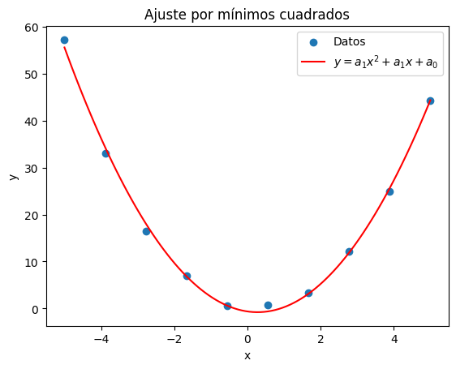

# Prueba 1 Mínimos cuadrados

## Cambios realizados:

### Funciones der_parcial_0_exp der_parcial_1_exp der_parcial_2_exp
La función der_parcial_0_exp se cambio por la derivada parcial de f respecto a "a" dando \Sumatoria(x^2(y-ax^2-bx-c)) = 0  
La función der_parcial_1_exp se cambio por la derivada parcial de f respecto a "b" dando \Sumatoria(x(y-ax^2-bx-c)) = 0  
La función der_parcial_1_exp se cambio por la derivada parcial de f respecto a "c" dando \Sumatoria((y-ax^2-bx-c)) = 0  

En código se cambio el c_ind a y, debido a que se despeja la ecuación

### Funcione curva
La función curva fue modificada para usar a2 * x**2 + a1 * x + a0, una función cuadrática 
